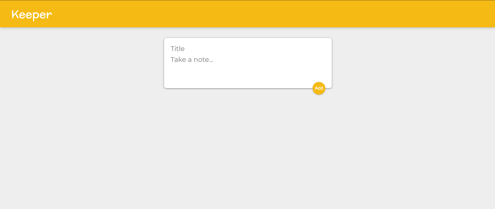

# WhatsApp Clone

## General Info

> A clone of Google Keep using Hooks and States in React.JS

## Tools and Technologies used

1. <b>React.js </b> :- For giving a user friendly frontend.
2. <b> Material-UI </b> :- For icons and images

## Screenshot

 

 
